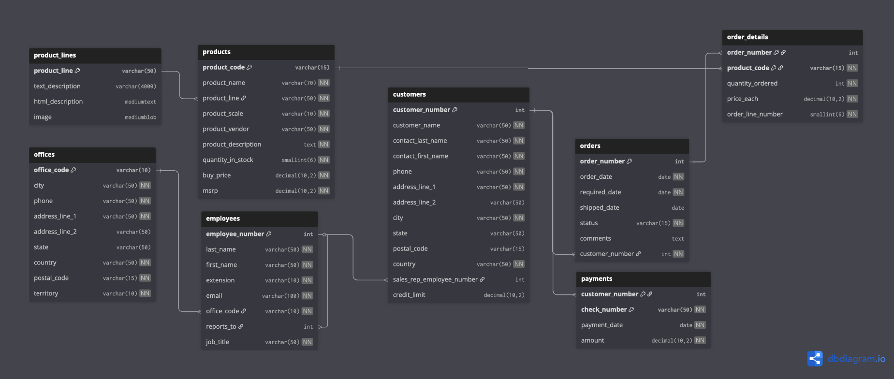

# ApplePy API

Welcome to the ApplePy API documentation!

## Entity Relationship Diagram

[](assets/erd.png)

## Overview

The ApplePy API provides RESTful endpoints for managing office locations in a model cars shop system. All endpoints return JSON responses with consistent error handling.

### Base URL

```
http://localhost:5000
```

### Response Format

All successful responses follow this format:

```json
{
  "data_key": "data_value"
}
```

Error responses include appropriate HTTP status codes and error messages.

---

## Offices Endpoints

The Offices API allows you to manage office locations with CRUD (Create, Read, Update, Delete) operations.

### Office Object

An Office object represents a physical office location with the following fields:

| Field | Type | Required | Description |
|-------|------|----------|-------------|
| `office_code` | string | Yes | Unique identifier for the office (max 10 characters) |
| `city` | string | Yes | City name where office is located |
| `state` | string | No | State or province code |
| `country` | string | No | Country name |
| `phone` | string | No | Office phone number |
| `address_line_1` | string | No | Primary address line |
| `address_line_2` | string | No | Secondary address line (suite, floor, etc.) |
| `postal_code` | string | No | Postal code or ZIP code |
| `territory` | string | No | Sales territory identifier |

### Get All Offices

Retrieve a list of all office locations.

**Endpoint:**
```
GET /offices
```

**Response:**
```json
{
  "offices": [
    {
      "office_code": "NYC",
      "city": "New York",
      "state": "NY",
      "country": "USA",
      "phone": "(212) 555-0100",
      "address_line_1": "123 Main Street",
      "address_line_2": "Suite 100",
      "postal_code": "10001",
      "territory": "1"
    }
  ]
}
```

**Status Codes:**
- `200 OK` - Successfully retrieved all offices
- `500 Internal Server Error` - Server error

---

### Get Office by Code

Retrieve a specific office by its unique code.

**Endpoint:**
```
GET /offices/{office_code}
```

**Parameters:**
- `office_code` (path, required): The unique office code

**Response:**
```json
{
  "office": {
    "office_code": "NYC",
    "city": "New York",
    "state": "NY",
    "country": "USA",
    "phone": "(212) 555-0100",
    "address_line_1": "123 Main Street",
    "address_line_2": "Suite 100",
    "postal_code": "10001",
    "territory": "1"
  }
}
```

**Status Codes:**
- `200 OK` - Successfully retrieved the office
- `404 Not Found` - Office with specified code does not exist
- `500 Internal Server Error` - Server error

**Example Request:**
```bash
curl http://localhost:5000/offices/NYC
```

---

### Create Office

Create a new office location.

**Endpoint:**
```
POST /offices
```

**Request Body:**
```json
{
  "city": "Los Angeles",
  "state": "CA",
  "country": "USA",
  "phone": "(213) 555-0200",
  "address_line_1": "456 Sunset Boulevard",
  "address_line_2": "Suite 500",
  "postal_code": "90028",
  "territory": "2"
}
```

**Response:**
```json
{
  "office": {
    "office_code": "LAX",
    "city": "Los Angeles",
    "state": "CA",
    "country": "USA",
    "phone": "(213) 555-0200",
    "address_line_1": "456 Sunset Boulevard",
    "address_line_2": "Suite 500",
    "postal_code": "90028",
    "territory": "2"
  }
}
```

**Status Codes:**
- `201 Created` - Office successfully created
- `400 Bad Request` - Invalid request data
- `500 Internal Server Error` - Server error

**Example Request:**
```bash
curl -X POST http://localhost:5000/offices \
  -H "Content-Type: application/json" \
  -d '{
    "city": "Los Angeles",
    "state": "CA",
    "country": "USA",
    "phone": "(213) 555-0200",
    "address_line_1": "456 Sunset Boulevard",
    "address_line_2": "Suite 500",
    "postal_code": "90028",
    "territory": "2"
  }'
```

---

### Update Office

Update an existing office location.

**Endpoint:**
```
PUT /offices/{office_code}
```

**Parameters:**
- `office_code` (path, required): The unique office code to update

**Request Body:**
```json
{
  "office_code": "NYC",
  "city": "New York",
  "state": "NY",
  "country": "USA",
  "phone": "(212) 555-0150",
  "address_line_1": "789 Park Avenue",
  "address_line_2": "Floor 15",
  "postal_code": "10022",
  "territory": "1"
}
```

**Response:**
```json
{
  "office": {
    "office_code": "NYC",
    "city": "New York",
    "state": "NY",
    "country": "USA",
    "phone": "(212) 555-0150",
    "address_line_1": "789 Park Avenue",
    "address_line_2": "Floor 15",
    "postal_code": "10022",
    "territory": "1"
  }
}
```

**Status Codes:**
- `200 OK` - Office successfully updated
- `404 Not Found` - Office with specified code does not exist
- `400 Bad Request` - Invalid request data
- `500 Internal Server Error` - Server error

**Example Request:**
```bash
curl -X PUT http://localhost:5000/offices/NYC \
  -H "Content-Type: application/json" \
  -d '{
    "office_code": "NYC",
    "city": "New York",
    "state": "NY",
    "country": "USA",
    "phone": "(212) 555-0150",
    "address_line_1": "789 Park Avenue",
    "address_line_2": "Floor 15",
    "postal_code": "10022",
    "territory": "1"
  }'
```

---

### Delete Office

Delete an office location.

**Endpoint:**
```
DELETE /offices/{office_code}
```

**Parameters:**
- `office_code` (path, required): The unique office code to delete

**Response:**
```json
{
  "message": "Office deleted"
}
```

**Status Codes:**
- `200 OK` - Office successfully deleted
- `404 Not Found` - Office with specified code does not exist
- `500 Internal Server Error` - Server error

**Example Request:**
```bash
curl -X DELETE http://localhost:5000/offices/NYC
```

---

## Error Handling

The API returns appropriate HTTP status codes and error messages:

| Status Code | Description |
|------------|-------------|
| `200 OK` | Successful GET, PUT, or DELETE request |
| `201 Created` | Successful POST request creating a new resource |
| `400 Bad Request` | Invalid request parameters or body |
| `404 Not Found` | Requested resource does not exist |
| `500 Internal Server Error` | Server-side error |

---

## Testing the API

You can test the Offices API using curl, Postman, or any HTTP client.

### Start the Server

```bash
uv run applepy flask
```

The server will start on `http://localhost:5000`.

### Basic Workflow

1. **Create an office:**
   ```bash
   curl -X POST http://localhost:5000/offices \
     -H "Content-Type: application/json" \
     -d '{"city":"Boston","state":"MA","country":"USA"}'
   ```

2. **List all offices:**
   ```bash
   curl http://localhost:5000/offices
   ```

3. **Get specific office:**
   ```bash
   curl http://localhost:5000/offices/BOS
   ```

4. **Update office:**
   ```bash
   curl -X PUT http://localhost:5000/offices/BOS \
     -H "Content-Type: application/json" \
     -d '{"office_code":"BOS","city":"Boston","state":"MA","country":"USA"}'
   ```

5. **Delete office:**
   ```bash
   curl -X DELETE http://localhost:5000/offices/BOS
   ```
